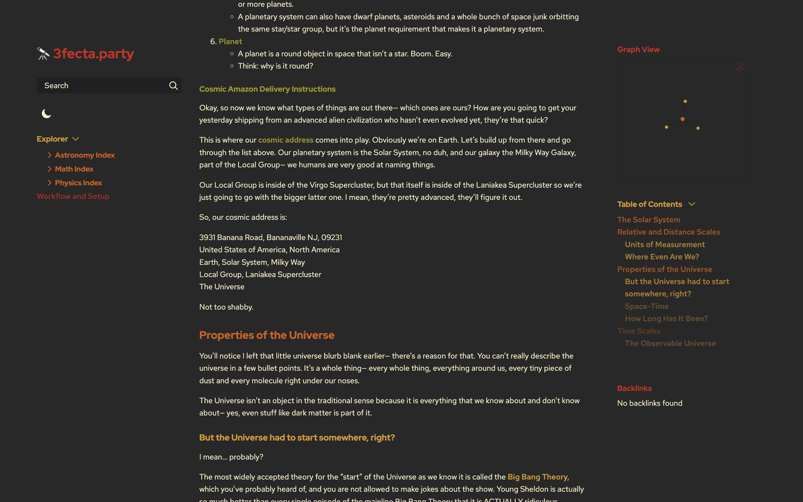
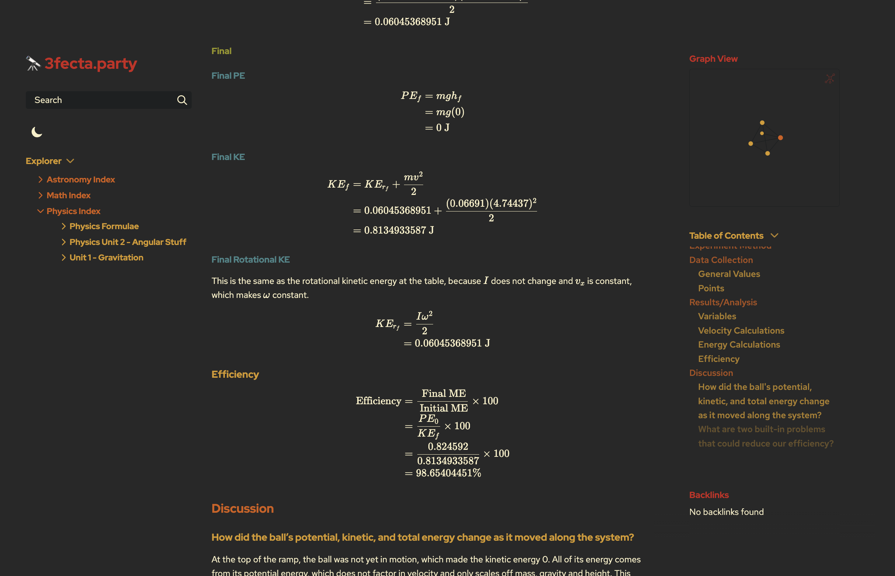

# quartz_gruvbox


# What is it?
Partial (read: very rough) adaption of [insanum/obsidian_gruvbox](https://github.com/insanum/obsidian_gruvbox) theme to learn Quartz. Features red/orange/yellow the most as that is what I'm partial to.

Light mode does not work well. It will blind you. Be warned. Just use dark mode I promise.

You can modify the main theme variables in variables.scss and along with quartz.config.ts. The custom code uses the variables, default Quartz themeing uses the layout in quartz.config.ts.

ExplorerNode.tsx is a slightly customized explorer node that just helps the theme with explorer stuff. If you don't want to replace your node, delete the block that starts with `#explorer-content` in custom.scss. You will not have the same explorer themeing though! You also need the [quartz_depthifier](https://github.com/tyrekosi/quartz_depthifier) plugin to theme links and strong elements.

# Applying the theme
Note: if you've already made modifications to your custom.css or callouts.scss, what I recommend is to view the files side-by-side by using Git or something like [TextCompare](https://www.textcompare.org/css/) to figure out how to piece 'em together.

1. Replace your files in the ./quartz/styles directory with those in the styles folder here.
2. Replace ./quartz/components/ExplorerNode.tsx with the version provided here.
3. Follow the setup instructions for [quartz_depthifier](https://github.com/tyrekosi/quartz_depthifier). Your configuration in quartz.config.ts should be `Plugin.Depthifier({ selectors: ["strong", "link"] })` to support the theming provided above.
4. In quartz.config.ts, replace your colors with the following:
      ```ts
      colors: {
        lightMode: {
          light: "#fbf1c7",
          lightgray: "#f9f5d7",
          gray: "#665c54",
          darkgray: "#282828",
          dark: "#9d0006",
          secondary: "#af3a03",
          tertiary: "#458588",
          highlight: "rgba(189, 174, 147, 0.15)",
        },
        darkMode: {
          light: "#282828",
          lightgray: "#1d2021",
          gray: "#bdae93",
          darkgray: "#fbf1c7",
          dark: "#cc241d",
          secondary: "#d65d0e",
          tertiary: "#d79921",
          highlight: "rgba(168, 153, 132, 0.15);",
        },
      },
      ```
